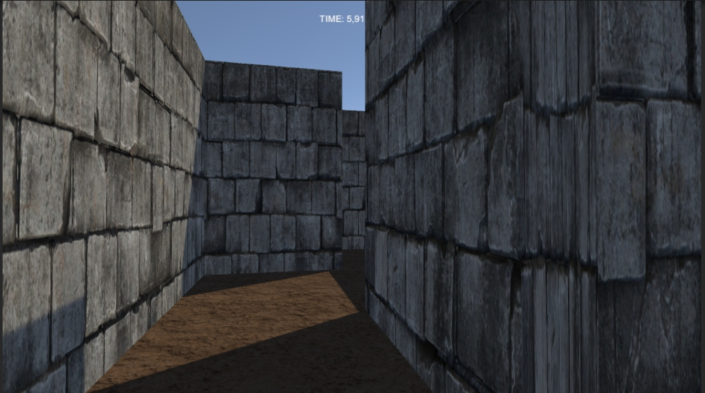
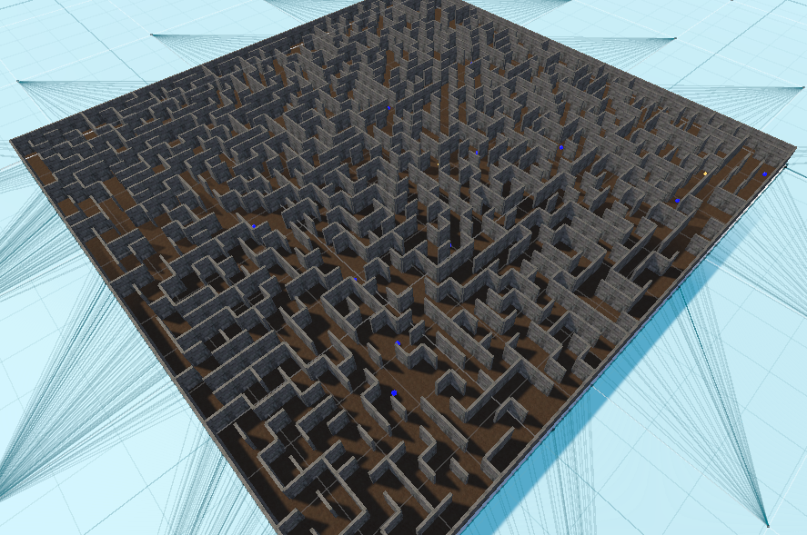

# 🏃‍♂️ 3D Maze Runner

Welcome to **Maze Runner**, a procedural 3D horror-puzzle game made with Unity. Escape the maze before the Minotaur catches you!

## 🎮 Controls

| Action | Key Bind |
| :--- | :--- |
| **Move** | `W`, `A`, `S`, `D` or Arrow Keys |
| **Sprint** | `Left Shift` |
| **Look** | Mouse |
| **Interact** | Auto-pickup by walking over items |

## 🌟 Features

*   **Procedural Maze Generation**: Every run is unique using a Recursive Backtracker algorithm with braiding (loops).
*   **Enemy AI**: A Minotaur that patrols and hunts the player using NavMesh.
*   **Power-ups**:
    *   ⚡ **Speed Boost**: Temporarily increases movement speed.
    *   🗺️ **Minimap**: Reveals a top-down view of the maze in the HUD.
*   **Leaderboard**: Tracks the top 5 fastest escape times locally.
*   **Dynamic Visuals**: Supports custom materials ("Brick", "Dirt") and emissions.

## � Screenshots

*First-person view inside the maze with custom textures.*

*Behold the complexity of the maze!*

## �🛠️ Setup & How to Play

1.  **Open Project**: Open this folder in Unity (2020.3 or later recommended).
2.  **Setup Scene**:
    *   In the Unity Editor menu bar, click **Maze Game** -> **Setup Scene**.
    *   This generates the maze, player, enemy, and applies materials.
3.  **Materials (Optional)**:
    *   Create materials named `Brick` or `Dirt` anywhere in the project to automatically texture the walls and floor.
4.  **Play**: Press the **Play** button in Unity.
    *   **Goal**: Find the **Green Zone** to escape.
    *   **Fail**: If the **Red Minotaur** touches you, it's Game Over.

## ⚙️ Customization

You can tweak the game settings on the `MazeGenerator` GameObject in the scene:
*   **Width/Height**: Change maze size (default 40x40).
*   **Speed Boost Chance**: Adjust how many speed potions spawn.
*   **Minimap Count**: Choose how many maps are hidden (default 1).

## 🏆 Leaderboard

*   Scores are saved locally.
*   To reset scores, click **Maze Game** -> **Clear Leaderboard Data** in the menu bar.

---

## 📥 Download Playable Build
You can download the latest playable version here:

👉 **[Download v1.0.0](https://github.com/MathisZUCCHERO/MazeRunner/releases/latest)**  
(Windows x86_64 – Extract and run `MazeRunner.exe`)

---
