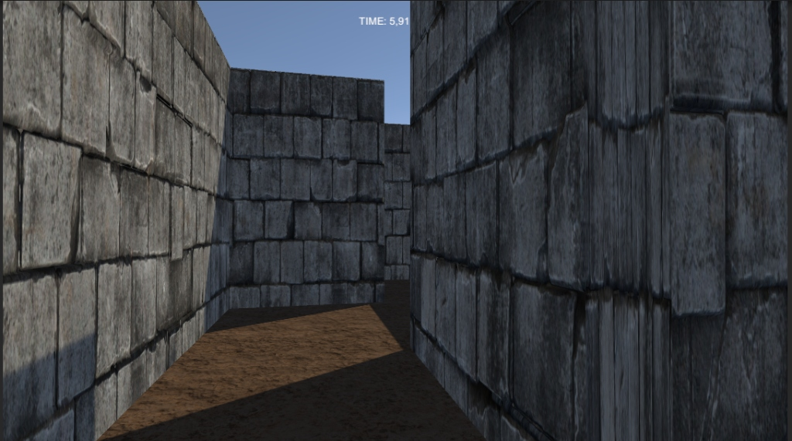
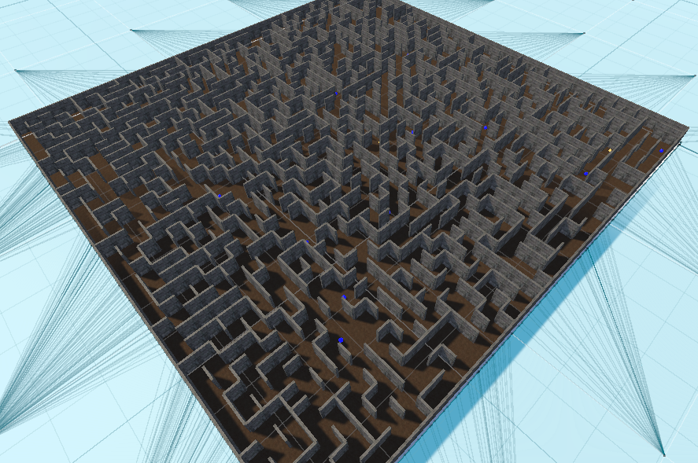

# 🏃‍♂️ 3D Maze Runner

Welcome to **Maze Runner**, a procedural 3D horror-puzzle game made with Unity. Escape the maze before the Minotaur catches you!

## 🎮 Controls

| Action | Key Bind |
| :--- | :--- |
| **Move** | `W`, `A`, `S`, `D` or Arrow Keys |
| **Sprint** | `Left Shift` |
| **Look** | Mouse |
| **Interact** | Auto-pickup by walking over items |
| **Quit** | `Escape` |

## 🌟 Features

*   **Procedural Maze Generation**: Every run is unique using a Recursive Backtracker algorithm with braiding (loops).
*   **Enemy AI**: A Minotaur that patrols and hunts the player using NavMesh.
*   **Power-ups**:
    *   ⚡ **Speed Boost**: Temporarily increases movement speed.
    *   🗺️ **Minimap**: Reveals a top-down view of the maze in the HUD.
    *   🔆 **Flashbang**: Temporarily stun the minotaur.
*   **Leaderboard**: Tracks the top 5 fastest escape times locally.
*   **Dynamic Visuals**: Supports custom materials ("Brick", "Dirt") and emissions.

## � Screenshots

*First-person view inside the maze with custom textures.*

*Behold the complexity of the maze!*

## �🛠️ Setup & How to Play

1.  **Open Project**: Open this folder in Unity (2020.3 or later recommended).
2.  **Setup Scene**:
    *   In the Unity Editor menu bar, click **Maze Game** -> **Setup Scene**.
    *   This generates the maze, player, enemy, and applies materials.
3.  **Materials (Optional)**:
    *   Create materials named `Brick` or `Dirt` anywhere in the project to automatically texture the walls and floor.
4.  **Play**: Press the **Play** button in Unity.
    *   **Goal**: Find the **Green Zone** to escape.
    *   **Fail**: If the **Red Minotaur** touches you, it's Game Over.

## ⚙️ Customization

You can tweak the game settings on the `MazeGenerator` GameObject in the scene:
*   **Width/Height**: Change maze size (default 40x40).
*   **Speed Boost Chance**: Adjust how many speed potions spawn.
*   **Minimap Count**: Choose how many maps are hidden (default 1).

## 🏆 Leaderboard

*   Scores are saved locally.
*   To reset scores, click **Maze Game** -> **Clear Leaderboard Data** in the menu bar.

---

## 📥 Download Playable Build
You can download the latest playable version here:

👉 **[Download v1.0.0](https://github.com/MathisZUCCHERO/MazeRunner/releases/latest)**  
(Windows x86_64 – Extract and run `MazeRunner.exe`)

---

##  ML-Agents Setup (AI Training)

### 1. Configuration Unity

Ouvrez Unity (Le package ML-Agents va s'installer automatiquement au lancement).

Sur votre **Prefab Player** (ou l'objet Player dans la scene) :
1.  Ajoutez le composant MazeAgent.
2.  Ajoutez le composant Decision Requester (**Decision Period**: 5).
3.  Ajoutez le composant Ray Perception Sensor 3D.
    *   **Detectable Tags** : Ajoutez Wall (assurez-vous que vos murs ont ce tag).
4.  Dans le script MazeAgent, glissez l'objet **EndTrigger** dans le champ **Target**.
5.  Assurez-vous que l'objet de fin (**EndTrigger**) a le Tag Finish.

####  Correction Configuration ML-Agents
Le nom par defaut dans Unity (My Behavior) peut causer des erreurs.

Dans le composant **Behavior Parameters** :
*   **Behavior Name** : MazeRunner (doit correspondre au fichier config).
*   **Actions** :
    *   **Continuous Actions** : Changez de 0 a **2** (Indispensable pour le mouvement).
    *   **Discrete Branches** : 0.
*   **Vector Observation** :
    *   **Space Size** : Changez de 2 a **5**. 

### 2. Lancer l'entrainement

Ouvrez un terminal dans le dossier du projet et activez l'environnement virtuel.
Ensuite, lancez la commande :

`powershell
.\venv\Scripts\mlagents-learn Config/maze_config.yaml --run-id=MazeRun2 --force
` 

### 3. Utiliser l'IA (Mode Inférence / Production)

Une fois l'entraînement "Hard" terminé :

1.  Allez dans le dossier `results/RunHard/MazeRunner`.
2.  Trouvez le fichier **.onnx** (ex: `MazeRunner-xxxx.onnx`).
3.  Glissez ce fichier dans Unity (dossier `Assets/Models` par exemple).
4.  Sélectionnez votre **Player**.
5.  Dans le composant **Behavior Parameters**, trouvez le champ **Model**.
6.  Glissez votre fichier `.onnx` dans ce champ.
7.  **IMPORTANT** : Dans `Behavior Parameters`, assurez-vous que **Behavior Type** est sur **Inference Only** (ou Default).

### 4. Mode Spectateur (Demo)

Pour apprécier le spectacle :
1.  Lancez le jeu.
2.  L'IA contrôlera le joueur.
3.  Vous pouvez juste regarder comment elle esquive le Minotaure et résout le labyrinthe ! 🍿

L'IA jouera toute seule avec le cerveau qu'elle a entraîné ! 🧠✨

### 4. Revenir au Jeu Normal (Hard Mode)

Pour tester l'IA dans les vraies conditions :
1.  Ouvrez `Assets/Scripts/Editor/GameSetup.cs`.
2.  Modifiez les lignes 460-466 pour remettre :
    *   `width = 40`
    *   `height = 40`
    *   `minotaurPrefab = minotaurPrefab` (Retirer le `null`)
3.  Lancez **Maze Game > Setup Scene**.
4.  Lancez le jeu et regardez l'IA survivre !
